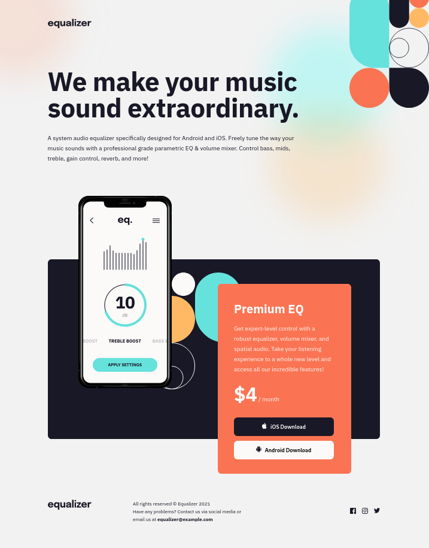

# Frontend Mentor - Equalizer landing page solution

This is a solution to the [Equalizer landing page challenge on Frontend Mentor](https://www.frontendmentor.io/challenges/equalizer-landing-page-7VJ4gp3DE). Frontend Mentor challenges help you improve your coding skills by building realistic projects.

## Table of contents

- [Overview](#overview)
  - [The challenge](#the-challenge)
  - [Screenshot](#screenshot)
  - [Links](#links)
- [My process](#my-process)
  - [Built with](#built-with)
  - [Useful resources](#useful-resources)
- [Author](#author)

## Overview

### The challenge

Users should be able to:

- View the optimal layout depending on their device's screen size
- See hover states for interactive elements

### Screenshot

### Links

- Solution URL: [URL]()
- Live Site URL: [URL](https://lisviks.github.io/equalizer-landing-page-frontendmentor/)

## My process

### Built with

- Semantic HTML5 markup
- Flexbox
- Mobile-first workflow

### Useful resources

- [SVG Color](https://css-tricks.com/change-color-of-svg-on-hover/) - Use a mask to change a external svg color

## Author

- Website - [Deividas Rimkus](https://github.com/Lisviks)
- Frontend Mentor - [@Lisviks](https://www.frontendmentor.io/profile/Lisviks)
- Twitter - [@DRimkusDev](https://www.twitter.com/DRimkusDev)
